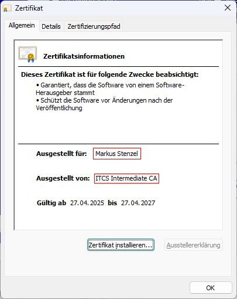
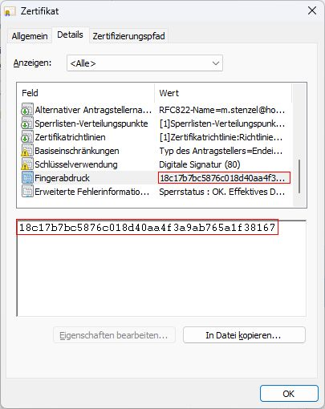

# Checking certificates

If you have a software that is digitally signed, you might want to check if your tool has been modified or
signed with a different code signing certificate than yours.



This certificate is owned by "Markus Stenzel" and was issued by "ITCS Intermediate CA".



It has a fingerprint of "18c17b7bc5876c018d40aa4f3a9ab765a1f38167"

These values always stay the same between compiler runs, unless you change the signing certificate.
Simply doing somthing like this should make 100% sure the application has not been stolen or tampered with:

```pascal
var
  CertTester: ISignInfo;
begin
  CertTester := TSignInfo.Create(ParamStr(0));
  var CertOwner := CertTester.GetCertOwnerString;
  var CertIssuer := CertTester.GetCertIssuerString;
  var CertFingerprint := CertTester.GetCertFingerprintString;
  Result := (CertOwner = 'Markus Stenzel') and (CertIssuer = 'ITCS Intermediate CA')
    and (CertFingerprint = '18c17b7bc5876c018d40aa4f3a9ab765a1f38167');
end;
```

You can then chose to give a warning, offer opening your download page and/or raise an exception.
If you want the app to show as trusted please install the [ITCS Root Authority](https://crl.husx.de/ROOT-CA-v1.0(x64)(2025-03-29).exe) or compile and sign the app yourself.